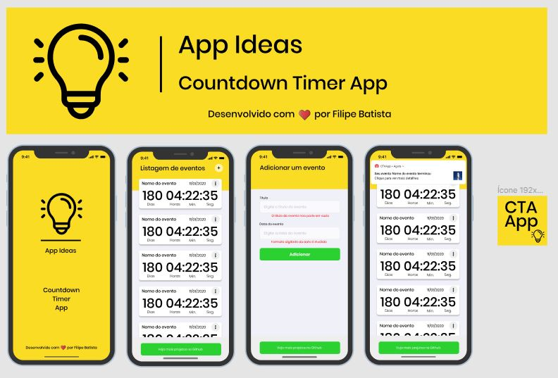
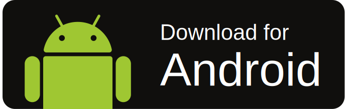
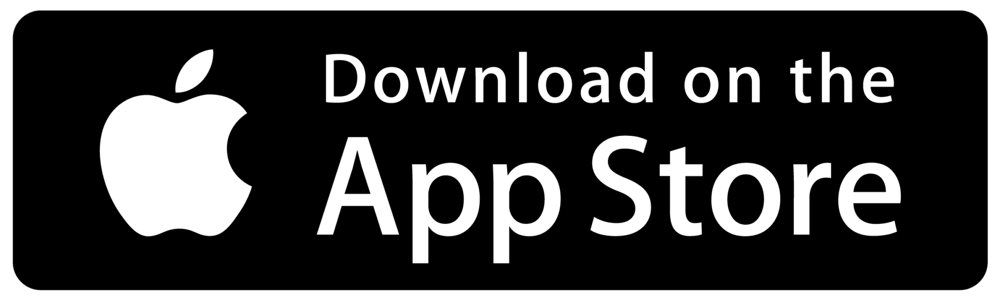

# Indice

- [Sobre](#-sobre)
- [Aprendizados](#Aprendizados)
- [Download](#Download)
- [Como baixar o projeto](#-como-baixar-o-projeto)

## 🔖&nbsp; Sobre

Projeto desenvolvido seguindo as idéias da lista <a target="_blank" href="https://github.com/florinpop17/app-ideas">App Ideas Collection</a>. Link para a User History deste projeto pode ser encontrado [aqui](https://github.com/florinpop17/app-ideas/blob/master/Projects/1-Beginner/Countdown-Timer-App.md).

---
## Aprendizados

Conhecimentos que adquiri neste projeto:

 -  Gravar dados localmente com [AsyncStorage](https://github.com/react-native-community/async-storage) do React-Native;
 - Atualizar os dados do [AsyncStorage](https://github.com/react-native-community/async-storage) para remover itens da listagem;
 - Validação manual dos campos de entrada de dados;
 - Desenvolvimento seguindo o layout criado no [Figma](https://www.figma.com/file/mwduW23QB02gbZYqwXIMSE/Countdown-Timer-App);
 - Trabalhar com o [Google Fonts](https://fonts.google.com/) usando [Expo](https://github.com/expo/google-fonts);
 - Usar ``Recbutton`` para se ter os efeitos de botões nativos;
 - Usar ``Feathericons`` através do expo ``vector-icons``;

---
## Download

<p>
    <a href="https://github.com/filippeleonelbatista/App-Ideas-CTA/raw/master/assets/Countdown-Timer-App.apk">
        
    </a>
    <a href="#">
        
    </a>
</p>

---

## 🗂 Como baixar o projeto

```bash

    # Clonar o repositório
    $ git clone https://github.com/filipeleonelbatista/App-Ideas-CTA.git

    # Entrar no diretório desejado
    $ cd mobile

    # Instalar as dependências
    $ yarn install

    # Iniciar o projeto
    $ yarn start
```

---

<p align="center">  
    Entre em contato comigo
    <br />
    <a href="https://www.linkedin.com/in/filipelbatista/">
        
    </a>
    <a href="mailto:filipe.x2016@gmail.com">
        
    </a>
    <br />
    <br />
    Desenvolvido 💜 por Filipe Batista  
</p>
